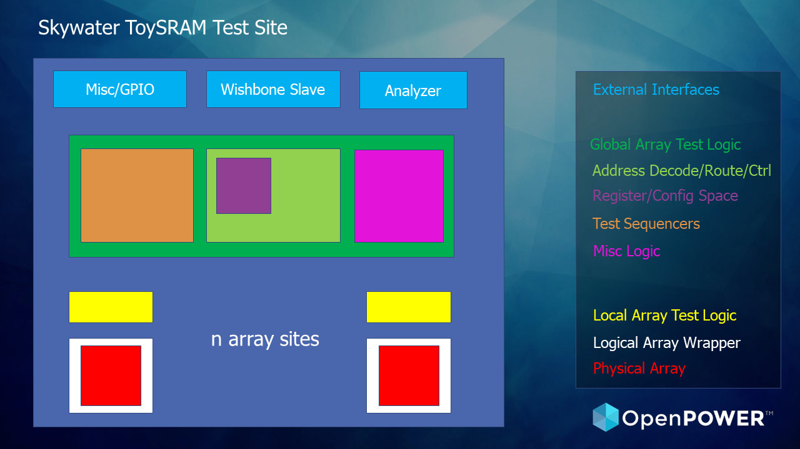

# ToySRAM

## A test site for a high-specific-bandwidth memory design

* We make high-specific-bandwidth multiport memories child’s play
* We make 10T SRAM a first-class citizen, and use pumping and replication for high frequency and additional ports

## Description

The goal is to demonstrate specific bandwidth results from 90nm to 2nm, and use
the basic design to grow as many ports as necessary through replication, to
produce more efficient processors and accelerators with *less circuit-design effort*.

What is specific bandwidth?

* It measures the read and write bandwidth per unit area
* Bandwidth per unit area is an analog to specific gravity, which is mass per unit volume
* It's more encompassing than bit density, which drives complexity to improve bandwidth

Why does Toy-SRAM do so well?

* It's enhanced by having a 10T SRAM/2 read ports/1 write port
* It supports low-cost super-pipelining (2x+ the system frequency, without latch overhead)
* It enables energy-efficient ultralow-voltage operation by avoiding read disturb

Specific bandwidth can be expressed with two metrics:

* Technology dependent “X TB/(sec * mm 2 )”
* Technology independent “Y 1/(FO4 delay * PC PITCH * min horizontal metal pitch)”

## Array Design (64x24_2R1W)

#### 2R1W memory cell

   * read bitlines are the NFET part of a domino stage

<image src="./cell.png">

#### Subarray

   * 16 word x 12 bit array of memory cells

#### 64x24_2R1W 'hard' array

   * (8) subarrays

   * (12) addr/strobe inputs per port are decoded to 64 word lines and precharge enable

   * subarray bitlines are precharged and combined with neighbor subarray in local eval cell

   * final data outs are selected from half-array local evals

#### 64x24_2R1W 'logical' array

   * strobe plus 6 address lines predecoded to 12 array input lines per port

   * port latching

### Other

#### SDR/DDR

   * double-pumping the strobe allows 4R2W operation

#### LSDL

   * a custom LSDL cell can be used to latch the outputs in the array

## Links

* skywater-pdk.slack.com#toysram

## To Do

### memory cell

* schem, layout, spice, liberty files
* *WRONG!* needs RWL0+RWL1

### 64x24 array

* subarray
   * 16x12 gds/lef needed
   * lib also?

* eval cell
   * can pfet be instantiated in rtl?
      * if not, just create a custom cell just for it (le_pullup); can make
        different strength versions and connect in rtl
   * custom cell; nand2 + pfet pullup gated by precharge for L/R

* quarter
   * single macro with L/R subarrays and eval stack between
   * then need just decode gap and i/o gap between four quarters

* full with placed std cell decoders, etc.
   * single macro with placed netlist cells

### 64x72 array

* rtl for in/out latching

* rtl for strobe (sdr, ddr delay taps)

* rtl for bist?

* rtl for cfg (strobe)

### Verif

* cycle sim for basic 64x72 rtl

* cycle sim for site

* spice sim for 16x12 + eval + 16x12 (quarter)?

### Site

* ring oscillator?

* multiarray?

* scan interface

* wb interface?

### Extras

* auto-convert memory cell and eval to 180 and build site

* lsdl latch in 64x24 for data outs

